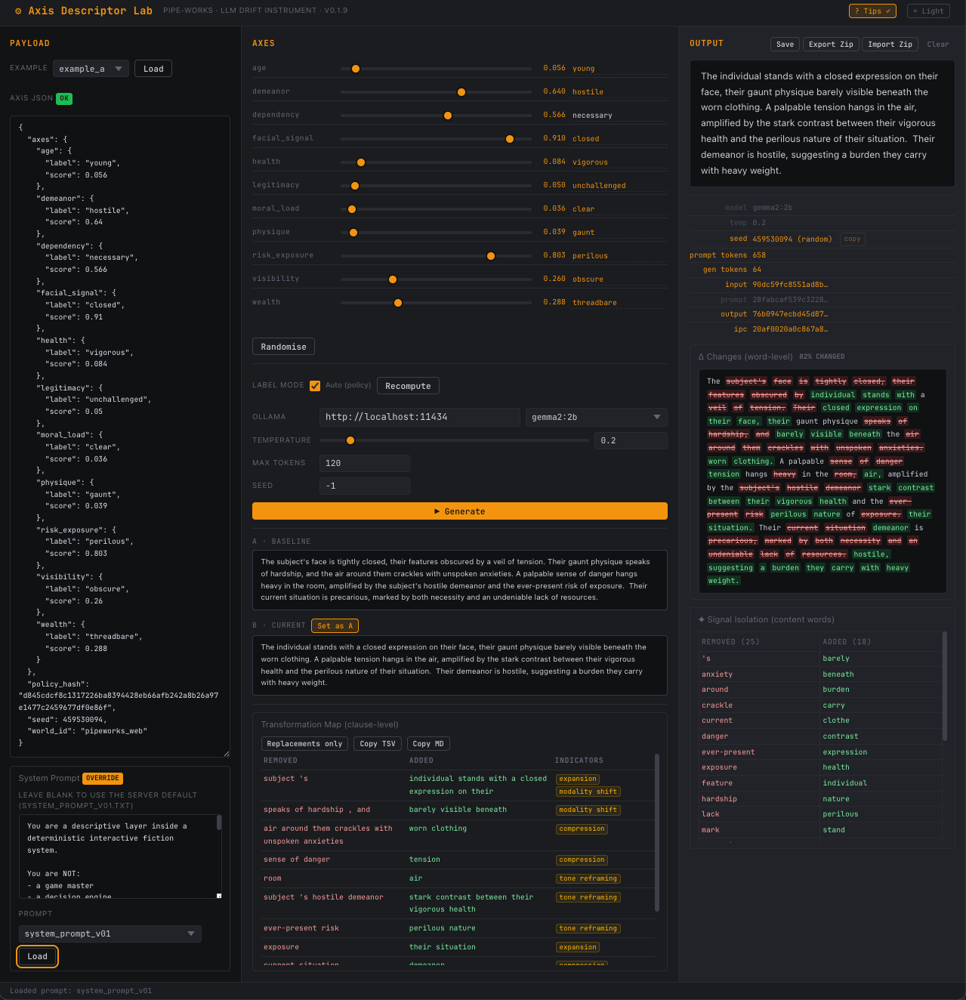

[](https://github.com/pipe-works/pipeworks_axis_descriptor_lab/actions/workflows/ci.yml) [](https://pipeworks-axis-descriptor-lab.readthedocs.io/en/latest/?badge=latest) [](https://codecov.io/gh/pipe-works/pipeworks_axis_descriptor_lab) [](https://www.gnu.org/licenses/gpl-3.0) [](https://www.python.org/downloads/) [](https://github.com/psf/black) [](https://github.com/astral-sh/ruff) [](https://github.com/pre-commit/pre-commit)

# Axis Descriptor Lab

Tiny web tool for testing how small LLMs (via Ollama) produce _non-authoritative_ descriptive text from a deterministic axis payload. Part of the [Pipe-Works](https://github.com/pipe-works) project.

**Key principle:** The system (axes, scores, seeds) is _authoritative_. The LLM is _ornamental_ -- it produces flavour text only, never makes decisions, and its output is never trusted as ground truth.

<p align="center">
  
</p>

## Quick start

```bash
# 1. Install dependencies into the padl virtualenv
pip install -e .

# 2. Copy .env.example and adjust if needed
cp .env.example .env

# 3. Make sure Ollama is running and the model is pulled
ollama pull gemma2:2b

# 4. Start the server
uvicorn app.main:app --reload --host 127.0.0.1 --port 8242
```

Then open **<http://127.0.0.1:8242>** in your browser.

## Usage

1. Choose an example from the dropdown (or paste your own JSON into the textarea).
2. Adjust axis scores with the sliders; labels update automatically in the textarea.
3. Optionally toggle **Auto (policy)** to let the server compute labels from score thresholds, then click **Recompute**.
4. Choose your Ollama model, temperature, and token budget.
5. Click **▶ Generate** to produce a descriptive paragraph.
6. Click **Set as A** to store the output as a baseline, then tweak axes and generate again to see the **Δ Changes** diff.
7. Use the **Prompt** dropdown inside the System Prompt collapsible to load alternative prompt styles (terse, environmental, contrast). The override badge glows amber when a custom prompt is active.
8. Click **Save** to persist the session state (payload, output, baseline, system prompt, and generation settings) to a timestamped subfolder under `data/`.

## Interpretive Provenance Chain (IPC)

Every generation is fingerprinted by the **Interpretive Provenance Chain** -- a composite SHA-256 hash of all variables that influence the output:

```text
IPC_ID = SHA-256(
    input_hash          -- canonical payload JSON
  + system_prompt_hash  -- normalised system prompt
  + model               -- Ollama model name
  + temperature          -- sampling temperature
  + max_tokens           -- token budget
  + seed                 -- RNG seed from the payload
)
```

Two generations with the same IPC ID used **identical inputs in every respect**. If their outputs differ, the difference is attributable solely to LLM stochasticity.

The IPC enables:

- **Prompt drift detection** -- attribute behavioural changes to specific prompt edits
- **Model drift detection** -- detect when a model upgrade alters output under identical conditions
- **Reproducibility audits** -- verify that a saved session can be reproduced
- **Run grouping** -- group log entries by IPC ID to measure output stability

Four hashes are computed and returned on every `/api/generate` response:

| Hash | What it fingerprints |
|------|---------------------|
| `input_hash` | Canonical AxisPayload (axes, scores, seed, policy, world) |
| `system_prompt_hash` | Normalised system prompt text |
| `output_hash` | Normalised LLM output text |
| `ipc_id` | Composite of all provenance fields above |

Hashes are displayed (truncated to 16 chars) in the UI meta area, persisted in `metadata.json` on save, and included in JSONL log entries.

For a comprehensive explanation of the IPC framework, normalisation rules, and design rationale, see the [IPC and Hashing Guide](https://pipeworks-axis-descriptor-lab.readthedocs.io/en/latest/guides/ipc-and-hashing.html) in the project documentation.

## Endpoints

| Method | Path | Description |
|--------|------|-------------|
| GET | `/` | SPA shell |
| GET | `/api/examples` | List example names |
| GET | `/api/examples/{name}` | Fetch a named example payload |
| GET | `/api/prompts` | List available prompt names |
| GET | `/api/prompts/{name}` | Fetch a named prompt's text |
| GET | `/api/models` | List locally-pulled Ollama models |
| GET | `/api/system-prompt` | Return the default system prompt |
| POST | `/api/generate` | Generate descriptive text |
| POST | `/api/log` | Persist a run log entry |
| POST | `/api/relabel` | Recompute labels from policy |
| POST | `/api/analyze-delta` | Content-word delta (signal isolation) |
| POST | `/api/transformation-map` | Clause-level diff with micro-indicators |
| POST | `/api/save` | Save session state to data/ |

Interactive API docs: **<http://127.0.0.1:8242/docs>**

## Project layout

```text
axis_descriptor_lab/
├─ README.md
├─ pyproject.toml
├─ .env.example
├─ app/
│  ├─ main.py                # FastAPI app — thin routing layer
│  ├─ hashing.py             # IPC normalisation and hash utilities
│  ├─ schema.py              # Pydantic v2 models
│  ├─ ollama_client.py       # HTTP wrapper around Ollama /api/generate
│  ├─ signal_isolation.py    # NLP pipeline for content-word delta
│  ├─ transformation_map.py  # Clause-level sentence alignment + diffing
│  ├─ save_package.py        # Manifest builder, zip archive, import/export
│  ├─ relabel_policy.py      # Policy table + score-to-label mapping
│  ├─ save_formatting.py     # Markdown builders + folder-name generator
│  ├─ file_loaders.py        # Example + prompt file loading/listing
│  ├─ micro_indicators.py   # Structural Learning Layer — 10 heuristic classifiers
│  ├─ data/
│  │  ├─ embodiment_v0_1.json    # Lexicon: abstract ↔ physical terms
│  │  ├─ abstraction_v0_1.json   # Lexicon: concrete ↔ abstract terms
│  │  └─ intensity_v0_1.json     # Lexicon: ordered intensity scales
│  ├─ prompts/
│  │  ├─ system_prompt_v01.txt
│  │  ├─ system_prompt_v02_terse.txt
│  │  ├─ system_prompt_v03_environmental.txt
│  │  └─ system_prompt_v04_contrast.txt
│  ├─ examples/
│  │  ├─ example_a.json
│  │  └─ example_b.json
│  ├─ static/
│  │  ├─ styles.css
│  │  ├─ mod-init.js           # ES module entry point
│  │  ├─ mod-state.js          # state singleton + DOM refs
│  │  ├─ mod-events.js         # event wiring coordinator
│  │  ├─ mod-utils.js          # pure utility functions
│  │  ├─ mod-status.js         # status bar
│  │  ├─ mod-sync.js           # JSON / slider / badge sync
│  │  ├─ mod-loaders.js        # example + prompt loading
│  │  ├─ mod-generate.js       # LLM generation + meta table
│  │  ├─ mod-diff.js           # word diff + signal isolation
│  │  ├─ mod-axis-actions.js   # relabel + randomise
│  │  ├─ mod-persistence.js    # save / export / import
│  │  ├─ mod-tooltip.js        # tooltip system
│  │  └─ mod-theme.js          # dark/light theme toggle
│  └─ templates/
│     └─ index.html
├─ docs/                     # Sphinx documentation (build with: make -C docs html)
│  ├─ conf.py
│  ├─ index.rst
│  ├─ api/                   # autodoc API reference
│  └─ guides/                # narrative guides (IPC, hashing)
├─ tests/                    # pytest test suite (547 tests, 99% coverage)
│  ├─ conftest.py
│  ├─ test_hashing.py
│  ├─ test_main.py
│  ├─ test_ollama_client.py
│  ├─ test_save_package.py
│  ├─ test_schema.py
│  ├─ test_signal_isolation.py
│  ├─ test_static_modules.py    # ES module structure verification
│  ├─ test_transformation_map.py
│  ├─ test_relabel_policy.py    # policy table + relabel logic
│  ├─ test_save_formatting.py   # Markdown builders + folder names
│  ├─ test_file_loaders.py      # file loading + listing
   │  └─ test_micro_indicators.py  # heuristic classifier tests
├─ data/                     # session saves (gitignored)
└─ logs/
   └─ run_log.jsonl          # created automatically on first log call
```

## Documentation

Full Sphinx documentation is available at [pipeworks-axis-descriptor-lab.readthedocs.io](https://pipeworks-axis-descriptor-lab.readthedocs.io/en/latest/).

To build locally:

```bash
pip install -e ".[docs]"
make -C docs html
open docs/_build/html/index.html
```

Key documentation pages:

- **[IPC and Hashing Guide](https://pipeworks-axis-descriptor-lab.readthedocs.io/en/latest/guides/ipc-and-hashing.html)** -- comprehensive explanation of the Interpretive Provenance Chain framework, normalisation rules, and design rationale
- **[API Reference](https://pipeworks-axis-descriptor-lab.readthedocs.io/en/latest/api/index.html)** -- auto-generated from docstrings for all Python modules

## Development

```bash
# Install with dev dependencies
pip install -e ".[dev]"

# Run tests
pytest                             # all 547 tests
pytest -v --cov --cov-report=term  # with coverage (99%)

# Lint
ruff check app/ tests/

# Pre-commit hooks (black, ruff, mypy, bandit, codespell)
pre-commit install
pre-commit run --all-files
```

## Environment variables

Configured via `.env` (copy from `.env.example`):

| Variable | Default | Purpose |
|----------|---------|---------|
| `OLLAMA_HOST` | `http://localhost:11434` | Ollama server URL |
| `DEFAULT_MODEL` | `gemma2:2b` | Default model for generation |
| `APP_HOST` | `127.0.0.1` | Server bind address |
| `APP_PORT` | `8242` | Server port |

## License

[GPL-3.0-or-later](LICENSE)
