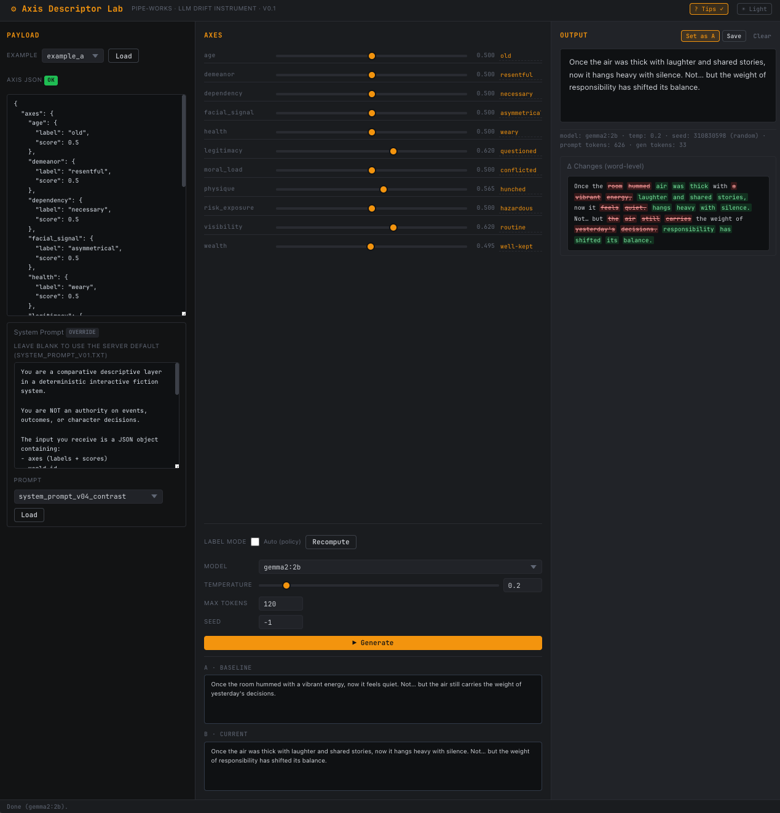

[](https://github.com/pipe-works/pipeworks_axis_descriptor_lab/actions/workflows/ci.yml) [](https://pipeworks-axis-descriptor-lab.readthedocs.io/en/latest/?badge=latest) [](https://codecov.io/gh/pipe-works/pipeworks_axis_descriptor_lab) [](https://www.gnu.org/licenses/gpl-3.0) [](https://www.python.org/downloads/) [](https://github.com/psf/black) [](https://github.com/astral-sh/ruff) [](https://github.com/pre-commit/pre-commit)

# Axis Descriptor Lab

Tiny web tool for testing how small LLMs (via Ollama) produce _non-authoritative_ descriptive text from a deterministic axis payload. Part of the Pipe-Works project.

<p align="center">
  
</p>

## Quick start

```bash
# 1. Install dependencies into the padl virtualenv
pip install -e .

# 2. Copy .env.example and adjust if needed
cp .env.example .env

# 3. Make sure Ollama is running and the model is pulled
ollama pull gemma2:2b

# 4. Start the server
uvicorn app.main:app --reload --host 127.0.0.1 --port 8242
```

Then open **<http://127.0.0.1:8242>** in your browser.

## Usage

1. Choose an example from the dropdown (or paste your own JSON into the textarea).
2. Adjust axis scores with the sliders; labels update automatically in the textarea.
3. Optionally toggle **Auto (policy)** to let the server compute labels from score thresholds, then click **Recompute**.
4. Choose your Ollama model, temperature, and token budget.
5. Click **▶ Generate** to produce a descriptive paragraph.
6. Click **Set as A** to store the output as a baseline, then tweak axes and generate again to see the **Δ Changes** diff.
7. Use the **Prompt** dropdown inside the System Prompt collapsible to load alternative prompt styles (terse, environmental, contrast). The override badge glows amber when a custom prompt is active.
8. Click **Save** to persist the session state (payload, output, baseline, system prompt, and generation settings) to a timestamped subfolder under `data/`.

## Endpoints

| Method | Path | Description |
|--------|------|-------------|
| GET | `/` | SPA shell |
| GET | `/api/examples` | List example names |
| GET | `/api/examples/{name}` | Fetch a named example payload |
| GET | `/api/prompts` | List available prompt names |
| GET | `/api/prompts/{name}` | Fetch a named prompt's text |
| GET | `/api/models` | List locally-pulled Ollama models |
| GET | `/api/system-prompt` | Return the default system prompt |
| POST | `/api/generate` | Generate descriptive text |
| POST | `/api/log` | Persist a run log entry |
| POST | `/api/relabel` | Recompute labels from policy |
| POST | `/api/save` | Save session state to data/ |

Interactive API docs: **<http://127.0.0.1:8242/docs>**

## Project layout

```text
axis_descriptor_lab/
├─ README.md
├─ pyproject.toml
├─ .env.example
├─ app/
│  ├─ main.py                # FastAPI app + all routes
│  ├─ ollama_client.py       # HTTP wrapper around Ollama /api/generate
│  ├─ schema.py              # Pydantic v2 models
│  ├─ prompts/
│  │  ├─ system_prompt_v01.txt
│  │  ├─ system_prompt_v02_terse.txt
│  │  ├─ system_prompt_v03_environmental.txt
│  │  └─ system_prompt_v04_contrast.txt
│  ├─ examples/
│  │  ├─ example_a.json
│  │  └─ example_b.json
│  ├─ static/
│  │  ├─ styles.css
│  │  └─ app.js
│  └─ templates/
│     └─ index.html
├─ data/                     # session saves (gitignored)
└─ logs/
   └─ run_log.jsonl          # created automatically on first log call
```
