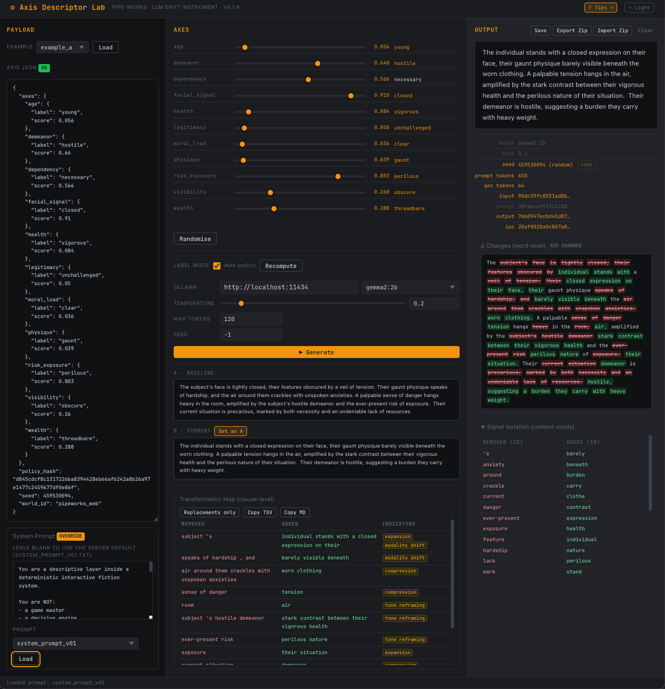

[](https://github.com/pipe-works/pipeworks_axis_descriptor_lab/actions/workflows/ci.yml) [](https://pipeworks-axis-descriptor-lab.readthedocs.io/en/latest/?badge=latest) [](https://codecov.io/gh/pipe-works/pipeworks_axis_descriptor_lab) [](https://www.gnu.org/licenses/gpl-3.0) [](https://www.python.org/downloads/) [](https://github.com/psf/black) [](https://github.com/astral-sh/ruff) [](https://github.com/pre-commit/pre-commit)

# Axis Descriptor Lab

Single-user web tool for testing how small LLMs (via Ollama) produce _non-authoritative_ descriptive text from deterministic axis payloads. Part of the [Pipe-Works](https://github.com/pipe-works) project.

**Key principle:** The system (axes, scores, seeds) is _authoritative_. The LLM is _ornamental_ -- it produces flavour text only, never makes decisions, and its output is never trusted as ground truth.

The lab has two pages:

- **Character Description** -- generate descriptive paragraphs from axis payloads with A/B diffing, signal isolation, and transformation-map analysis.
- **Chat Translation** -- translate out-of-character (OOC) player messages into in-character (IC) speech using axis-defined character profiles. Works standalone (local Ollama) or connected to a [Pipe-Works mud server](https://github.com/pipe-works/pipeworks_mud_server) for canonical pipeline translation.

<p align="center">
  
</p>

## Quick start

```bash
# 1. Install dependencies
pip install -e .

# 2. Copy .env.example and adjust if needed
cp .env.example .env

# 3. Make sure Ollama is running and the model is pulled
ollama pull gemma2:2b

# 4. Start the server
uvicorn app.main:app --reload --host 127.0.0.1 --port 8242

# Or use the dev launcher (reads .env first):
python tools/dev_server.py
```

Then open **<http://127.0.0.1:8242>** in your browser.

## Usage

### Character Description page

1. Choose an example from the dropdown (or paste your own JSON into the textarea).
2. Adjust axis scores with the sliders; labels update automatically in the textarea.
3. Optionally toggle **Auto (policy)** to let the server compute labels from score thresholds, then click **Recompute**.
4. Choose your Ollama model, temperature, and token budget.
5. Click **▶ Generate** to produce a descriptive paragraph.
6. Click **Set as A** to store the output as a baseline, then tweak axes and generate again to see the **Δ Changes** diff.
7. Use the **Prompt** dropdown inside the System Prompt collapsible to load alternative prompt styles (terse, environmental, contrast). The override badge glows amber when a custom prompt is active.
8. Click **Save** to persist the session state (payload, output, baseline, system prompt, and generation settings) to a timestamped subfolder under `data/`.

### Chat Translation page

1. Load examples for **Character A** and optionally **Character B** -- each gets independent axis sliders, an OOC message field, and a channel selector (say/yell/whisper).
2. Use per-axis checkboxes to enable or disable individual axes in the character profile sent to the LLM.
3. Click **▶ Translate** to translate both characters' OOC messages into IC speech in a single request.
4. Toggle **Live** mode to reveal per-character **Send** buttons and an in-game output log that accumulates entries in MUD-style format.
5. Use **Copy TXT**, **Copy MD**, or **Save all data** to export the game log.

**Server mode:** When `MUD_SERVER_URL` is configured in `.env`, the Chat Translation page connects to a mud server for canonical translation. A mode badge indicates the connection type (Standalone / Server local / Server prod). In server mode:

- A login panel appears for mud server authentication.
- After login, a world selector loads available worlds from the server.
- The server's model and active axes are displayed read-only; axes not active in the selected world are visually dimmed.
- Ollama host, model, strict mode, max tokens, max chars, and IC prompt controls are hidden (the server controls these).
- Temperature and seed remain adjustable (forwarded to the server).
- Session expiry (401) is handled automatically by returning to the login panel.

## Interpretive Provenance Chain (IPC)

Every generation is fingerprinted by the **Interpretive Provenance Chain** -- a composite SHA-256 hash of all variables that influence the output:

```text
IPC_ID = SHA-256(
    input_hash          -- canonical payload JSON
  + system_prompt_hash  -- normalised system prompt
  + model               -- Ollama model name
  + temperature          -- sampling temperature
  + max_tokens           -- token budget
  + seed                 -- RNG seed from the payload
)
```

Two generations with the same IPC ID used **identical inputs in every respect**. If their outputs differ, the difference is attributable solely to LLM stochasticity.

The IPC enables:

- **Prompt drift detection** -- attribute behavioural changes to specific prompt edits
- **Model drift detection** -- detect when a model upgrade alters output under identical conditions
- **Reproducibility audits** -- verify that a saved session can be reproduced
- **Run grouping** -- group log entries by IPC ID to measure output stability

Four hashes are computed and returned on every `/api/generate` and `/api/translate_chat` response:

| Hash | What it fingerprints |
|------|---------------------|
| `input_hash` | Canonical AxisPayload (axes, scores, seed, policy, world) |
| `system_prompt_hash` | Normalised system prompt text |
| `output_hash` | Normalised LLM output text |
| `ipc_id` | Composite of all provenance fields above |

Hashes are displayed (truncated to 16 chars) in the UI meta area, persisted in `metadata.json` on save, and included in JSONL log entries. Hashing is provided by the [`pipeworks_ipc`](https://github.com/pipe-works/pipeworks_ipc) library.

For a comprehensive explanation of the IPC framework, normalisation rules, and design rationale, see the [IPC and Hashing Guide](https://pipeworks-axis-descriptor-lab.readthedocs.io/en/latest/guides/ipc-and-hashing.html) in the project documentation.

## Endpoints

### Character Description

| Method | Path | Description |
|--------|------|-------------|
| GET | `/` | SPA shell |
| GET | `/api/examples` | List example names |
| GET | `/api/examples/{name}` | Fetch a named example payload |
| GET | `/api/prompts` | List available prompt names |
| GET | `/api/prompts/{name}` | Fetch a named prompt's text |
| GET | `/api/models` | List locally-pulled Ollama models |
| GET | `/api/system-prompt` | Return the default system prompt |
| POST | `/api/generate` | Generate descriptive text |
| POST | `/api/log` | Persist a run log entry |
| POST | `/api/relabel` | Recompute labels from policy |
| POST | `/api/analyze-delta` | Content-word delta (signal isolation) |
| POST | `/api/transformation-map` | Clause-level diff with micro-indicators |
| POST | `/api/save` | Save session state to data/ |
| GET | `/api/save/{folder}/export` | Download a save package as zip |
| POST | `/api/import` | Import a save package from zip |

### Chat Translation

| Method | Path | Description |
|--------|------|-------------|
| POST | `/api/translate_chat` | OOC→IC translation for one or two characters |
| POST | `/api/save_chat` | Save chat session state |
| POST | `/api/import_chat` | Import a chat save package from zip |

### Mud Server Proxy

These endpoints proxy requests to the mud server when `MUD_SERVER_URL` is configured.

| Method | Path | Description |
|--------|------|-------------|
| POST | `/api/mud/login` | Proxy login to mud server |
| POST | `/api/mud/logout` | Clear mud server session |
| GET | `/api/mud/session` | Check authentication status |
| GET | `/api/mud/worlds` | List available worlds |
| GET | `/api/mud/world-config/{world_id}` | Get world configuration |
| POST | `/api/mud/select-world` | Select world for translation |

Interactive API docs: **<http://127.0.0.1:8242/docs>**

## Project layout

```text
axis_descriptor_lab/
├─ README.md
├─ pyproject.toml
├─ .env.example
├─ app/
│  ├─ main.py                # FastAPI app bootstrap + router mounting
│  ├─ config.py              # Shared app paths, defaults, and version metadata
│  ├─ routes_chat.py         # Chat translation + save endpoints
│  ├─ routes_mud.py          # /api/mud/* proxy endpoints
│  ├─ routes_save.py         # Save/export/system-prompt endpoints
│  ├─ schema/                # Pydantic v2 models split by domain
│  │  ├─ __init__.py         # Backward-compatible re-exports for app.schema
│  │  ├─ axis.py
│  │  ├─ generate.py
│  │  ├─ save.py
│  │  ├─ analysis.py
│  │  ├─ chat.py
│  │  └─ mud.py
│  ├─ services/
│  │  ├─ __init__.py
│  │  ├─ chat_translation.py # Chat translation orchestration helpers
│  │  └─ save_service.py     # Save/export orchestration helpers
│  ├─ chat_renderer.py       # Unified Ollama HTTP client (/api/generate + /api/chat)
│  ├─ signal_isolation.py    # NLP pipeline for content-word delta
│  ├─ transformation_map.py  # Clause-level sentence alignment + diffing
│  ├─ micro_indicators.py    # Structural Learning Layer — 10 heuristic classifiers
│  ├─ output_validator.py    # OOC→IC output validator (7-step pipeline)
│  ├─ mud_server_client.py   # Mud server proxy client for chat translation
│  ├─ relabel_policy.py      # Policy table + score-to-label mapping
│  ├─ save_package.py        # Manifest builder, zip archive, import/export
│  ├─ save_formatting.py     # Markdown builders + folder-name generator
│  ├─ file_loaders.py        # Example + prompt file loading/listing
│  ├─ data/
│  │  ├─ embodiment_v0_1.json    # Lexicon: abstract ↔ physical terms
│  │  ├─ abstraction_v0_1.json   # Lexicon: concrete ↔ abstract terms
│  │  └─ intensity_v0_1.json     # Lexicon: ordered intensity scales
│  ├─ prompts/
│  │  ├─ system_prompt_v01.txt          # Default character description prompt
│  │  ├─ system_prompt_v02_terse.txt
│  │  ├─ system_prompt_v03_environmental.txt
│  │  ├─ system_prompt_v04_contrast.txt
│  │  ├─ ic_v01_undertaking.txt         # IC prompt for The Undertaking world
│  │  ├─ ic_v02_generic.txt             # Generic IC prompt
│  │  └─ ic_v03_development.txt         # Development/testing IC prompt
│  ├─ examples/
│  │  ├─ example_a.json
│  │  └─ example_b.json
│  ├─ static/
│  │  ├─ pipe-works-fonts.css   # @font-face declarations (6 font families)
│  │  ├─ pipe-works-base.css    # Shared Pipe-Works design system
│  │  ├─ styles.css             # App-specific styles
│  │  ├─ fonts/                 # 16 woff2 font files
│  │  ├─ mod-init.js            # ES module entry point
│  │  ├─ mod-state.js           # State singleton + DOM refs
│  │  ├─ mod-events.js          # Event wiring coordinator
│  │  ├─ mod-utils.js           # Pure utility functions
│  │  ├─ mod-status.js          # Status bar
│  │  ├─ mod-sync.js            # JSON / slider / badge sync
│  │  ├─ mod-loaders.js         # Example + prompt loading
│  │  ├─ mod-generate.js        # LLM generation + meta table
│  │  ├─ mod-diff.js            # Word diff + signal isolation
│  │  ├─ mod-axis-actions.js    # Relabel + randomise
│  │  ├─ mod-persistence.js     # Save / export / import
│  │  ├─ mod-navigation.js      # Page switching (Char Description ↔ Chat Translation)
│  │  ├─ mod-chat-state.js      # Chat Translation page state + DOM bundle
│  │  ├─ mod-chat-server-mode.js # Mud-server auth/world/prompt behaviour
│  │  ├─ mod-chat-sliders.js    # Chat Translation slider + JSON sync helpers
│  │  ├─ mod-chat-game-log.js   # Game-log rendering, clipboard, and save helpers
│  │  ├─ mod-chat-import.js     # Chat save import + restore helpers
│  │  ├─ mod-chat-translation.js # Chat Translation page controller/orchestration
│  │  ├─ mod-indicator-modal.js # Indicator tooltip + click modal
│  │  ├─ mod-tooltip.js         # Tooltip system
│  │  └─ mod-theme.js           # Dark/light theme toggle
│  └─ templates/
│     └─ index.html             # SPA shell (Jinja2)
├─ docs/                        # Sphinx documentation (build with: make -C docs html)
│  ├─ conf.py
│  ├─ index.rst
│  ├─ api/                      # Autodoc API reference
│  └─ guides/                   # Narrative guides (IPC, hashing)
├─ tests/                       # pytest test suite (773 tests)
│  ├─ conftest.py
│  ├─ test_main.py              # Endpoint integration tests
│  ├─ test_schema.py
│  ├─ test_chat_renderer.py     # Ollama HTTP client tests
│  ├─ test_signal_isolation.py
│  ├─ test_transformation_map.py
│  ├─ test_micro_indicators.py  # Heuristic classifier tests
│  ├─ test_output_validator.py  # OOC→IC validator tests
│  ├─ test_mud_server_client.py # Mud server proxy client tests
│  ├─ test_mud_proxy_endpoints.py # Mud proxy endpoint tests
│  ├─ test_translate_chat_endpoint.py
│  ├─ test_save_chat_endpoint.py
│  ├─ test_save_package.py
│  ├─ test_save_formatting.py
│  ├─ test_relabel_policy.py
│  ├─ test_file_loaders.py
│  └─ test_static_modules.py    # ES module structure verification
├─ tools/
│  └─ dev_server.py             # Dev launcher (reads .env)
├─ data/                        # Session saves (gitignored)
└─ logs/
   └─ run_log.jsonl             # Created automatically on first log call
```

## Documentation

Full Sphinx documentation is available at [pipeworks-axis-descriptor-lab.readthedocs.io](https://pipeworks-axis-descriptor-lab.readthedocs.io/en/latest/).

To build locally:

```bash
pip install -e ".[docs]"
make -C docs html
open docs/_build/html/index.html
```

Key documentation pages:

- **[IPC and Hashing Guide](https://pipeworks-axis-descriptor-lab.readthedocs.io/en/latest/guides/ipc-and-hashing.html)** -- comprehensive explanation of the Interpretive Provenance Chain framework, normalisation rules, and design rationale
- **[API Reference](https://pipeworks-axis-descriptor-lab.readthedocs.io/en/latest/api/index.html)** -- auto-generated from docstrings for all Python modules

## Development

```bash
# Install with dev dependencies
pip install -e ".[dev]"

# Run tests
pytest                             # all 773 tests
pytest -v --cov --cov-report=term  # with coverage

# Lint
ruff check app/ tests/

# Pre-commit hooks (black, ruff, mypy, bandit, codespell)
pre-commit install
pre-commit run --all-files
```

## Environment variables

Configured via `.env` (copy from `.env.example`):

| Variable | Default | Purpose |
|----------|---------|---------|
| `OLLAMA_HOST` | `http://localhost:11434` | Ollama server URL |
| `DEFAULT_MODEL` | `gemma2:2b` | Default model for generation |
| `APP_HOST` | `127.0.0.1` | Server bind address |
| `APP_PORT` | `8242` | Server port |
| `MUD_SERVER_URL` | _(unset)_ | Mud server URL for Chat Translation server mode. Unset = standalone. |
| `MUD_SERVER_TIMEOUT` | `120` | Timeout (seconds) for mud server proxy requests |

## License

[GPL-3.0-or-later](LICENSE)
